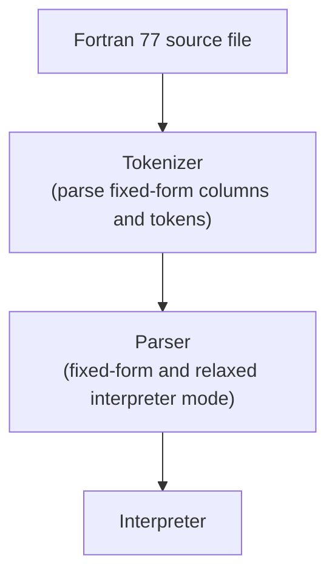

# f77interpret

A Fortran 77 interpreter supporting both legacy fixed-form column rules and a relaxed interpreter mode with no line-length limit.

## Building

Requires CMake 3.14+, a C++23 compiler, and Boost 1.70+ (with the `program_options` component).

```sh
cmake -B build -S .
cmake --build build
```

The executable is placed at `build/bin/f77interpret`.

## Running

```sh
./build/bin/f77interpret
```

## Running Tests

Unit tests are not yet enabled. The test framework (Google Test) is prepared in `test/CMakeLists.txt` and will be activated once the test suite is ready.

## Architecture

The project is in early development. No interfaces or abstract classes are defined yet. Planned components based on the current roadmap:



### Key Abstractions

No public interfaces are defined yet. Architecture documentation will be updated in `docs/memory/architecture.md` as the tokenizer and parser are implemented.
