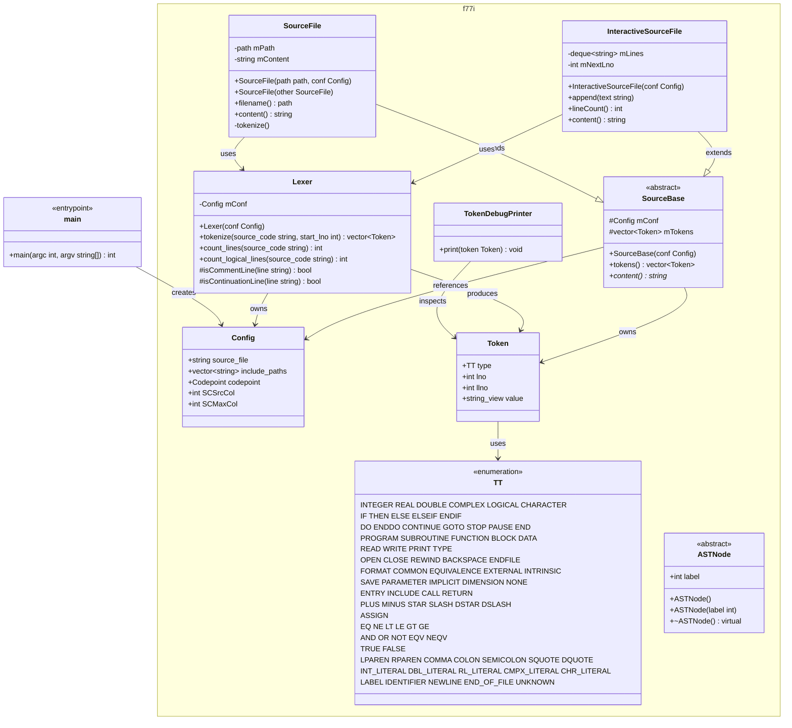

# Architecture

This file contains the mermaid class diagram describing the architecture of this project.
Update this diagram when making structural changes (new classes, interfaces, relationships, method signatures).
Changes here drive source code updates via the agent-memory-v2 skill (Path C).

