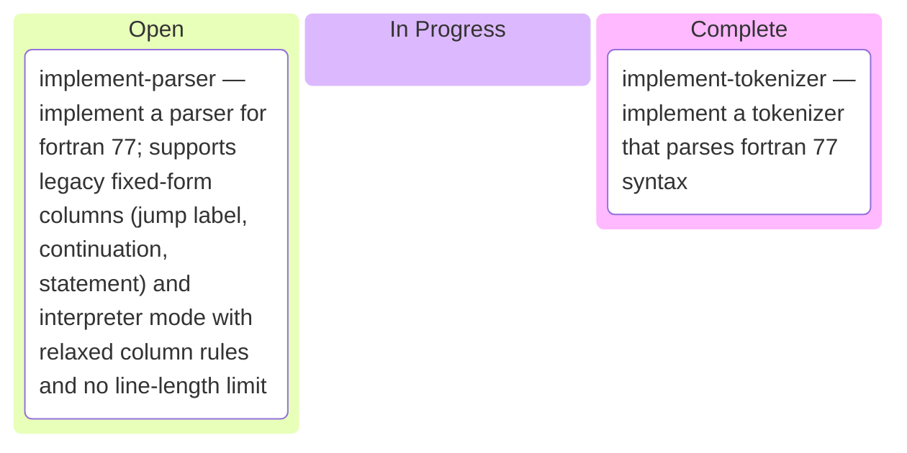

# Kanban

```mermaid
kanban
    open[Open]
        implement-parser["implement-parser — implement a parser for fortran 77; supports legacy fixed-form columns (jump label, continuation, statement) and interpreter mode with relaxed column rules and no line-length limit"]
    inprogress[In Progress]
    complete[Complete]
        implement-tokenizer["implement-tokenizer — implement a tokenizer that parses fortran 77 syntax"]
```
